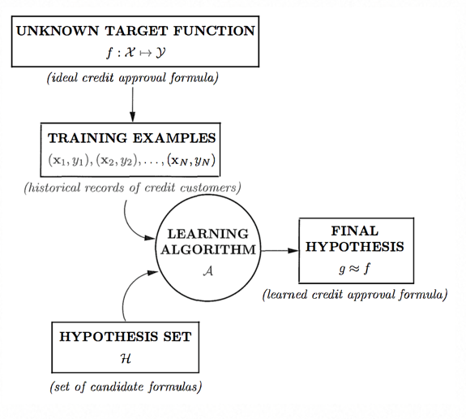
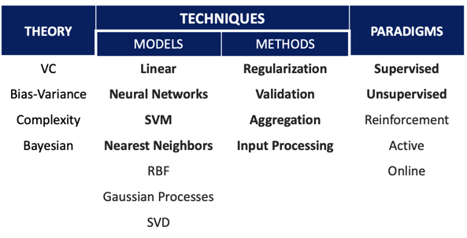
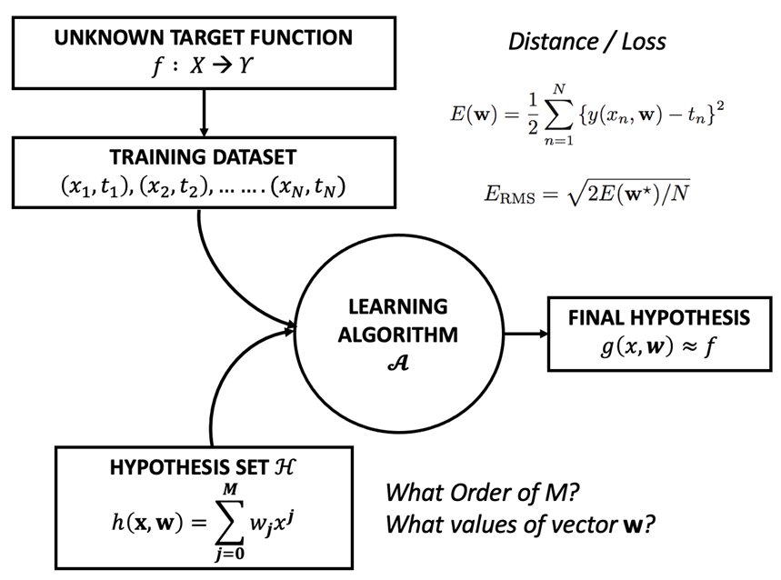

## Perbedaan ML DL
Machine Learning adalah model-model yang digunakan untuk mempelajari pola/regularity/pattern dalam data. deep learning adalah machine learning menggunakan neural network

## Metode FCP
FCP adalah proses belajar untuk menjadi scientist atau engineer. FCP adalah singkatan dari Fundamental, Conceptual dan Practical.
- Fundamental , belajar matematika, statistika dll
- Conceptual
- Practical, belajar bahasa python R dll

## Perbedaan ML dan Programming
Machine learning berbeda dengan python programming. Machine learning adalah pemodelan matematis sementara programming adalah implementasi praktisnya saja.

## Machine Learning Problem 

Manusia sudah mencari pola dalam data sejak dahulu. Contoh manusia sejak zaman dahulu belajar dari data seperti mengukur konstanta menggunakan pengukuran dari benda yang diketahui ketinggiannya kemudian dicatat time nya sehingga menghasilkan nilai konstanta. Machine learnig problem adalah mencari problem/pattern/pola dalam data. Dimana memiliki 3 machine learning essential problem yaitu
- **Pola nya ada**, jika tidak ada pola maka ML tidak dapat digunakan. Misal dalam KTP terdapat banyak Pola/feature seperti NIK, Foto dll. Umumnnya setiap data memiliki banyak pola.
- Apabila pola yang ada dalam data dapat dipelajari dengan rumus matematis (fungsi) maka tidak memerlukan ML. Jika **tidak ada aturan matematis** untuk penyelesaiannya dapat digunakan sebagi machine learning problem dan selama masih ada aturan matematis tertulis untuk menyelesaikan masalah tidak pelu menggunakan machine learning.
- Machine learning hanya membutuhkan **data yang cukup**, tidak ada keharusan dalam penggunaan big data. Berapa jumlah data yang dapat dikatakan cukup ? masih dalam peneltiian . Misal dalam suatu pemilu untuk menentukan siapa pasangan terpilih kita tidak perlu semua suara untuk memastika siapa yang menang, hanya memerlukan sebagian saja karena membaca pola yang ada.

Sebelumnnya machine learning digunakan untuk masalah yang sulit untuk manusia dan mudah untuk komputer. Misal pekerjaan yang berulang ketika dikerjakan manusia akan membutuhkan waktu yang lama namun setelah diketahui pola dan dikerjakan dengan komputer akan diselesaikan dengan cepat. Namun pola saat ini terbalik, machine learning digunakan pekerjaan yang mudah untuk manusia dan sulit untuk komputer seperti text-to-speech yang artinya komputer sedang dibuat sepintar manusia.

## Komponen Machine Learning
    
- **credit card approval**
    - Dalam KPR untuk kredit pembelian rumah.
        - misal data (X), form data para calon nasabah
        - output (y), rekomendasi output (good/bad)
        - data (data histori yang ada di bank)
        - jika ada asumsi dll maka perlu diabaikan, karena hanya menggunakan data history

- bagaimana machine learning bekerja ?
    membuat hypothesis final dari sekumpulan hypothesis set (pembuatan hypotesis set bisa bersumber dari mana saja, misal dari statistika, math dll apapun yang dapat mendekati final hypothesis) menggunakan algoritma yang terstruktur. 
        
- machine learning model adalah hypothesis set + learning algorithm

## Paradigma Machine Learning
    - **supervised** adalah paradigma ML ketika terdapat input, ouput/label dan dapat memprediksi ouput baru jika diberikan inputan baru. misal 1000 email yang dipetakan menjadi email spam or not
    - **unsupervised**, jika hanya ada input saja tanpa ada label. contoh clustering misal mesin koin yang terdapt 10000 koin data, untuk clustering dapat dilakukan dengan memperhatikan beratnya.
    - **reinforcement**, label datang belakang. jadi terdapat label diakhir proses. contoh main catur, dimana untuk menjalankan keputusan mengharuskan feedback dari lawan. manusia belajar dari reinforcement dan pengembangan masih terus dilakukan.

## Gambaran Luas ML

    - Machine learning merupakan kumpulan teknik yang berjumlahnya mencapai ribuan.
    - model = hypotehsis set + algorithm
    - method = how to make works well
    - paradigm = the way we see ML Problems

    
## Supervised learning
    - masalah : bagaimana kita melakukan estimasi/aproksimasi/pendekatan unknown function yang memetakan data ke label
    - misal label atau ouput adalah
        - kategori maka klasifikasi
        - kontinu maka regresi
    - membuat hypotesis set > nearest neighbor, linear model, decision tree
    - teknik > memilih algoritma untuk menemukan fungsi yang paling mendekati dengan error yang paling kecil
    
    contoh
    - problem = simple linear regression
    - hypotesis set = linear model - polynomial
    - goal = good generalization
    - learning algoritm,
        - miniminze SE function E with GD
        - minimize RMSE
    

    - Mencari final hypotesis dari fungsi polynomial dari fungsi hijau yang tidak diketahui.
    - overfitting terjadi ketika di train bagus dilatih jelek
    - teknik overfitting
        - regulerisasi
    
## regularisasi
regulerisasi adalah menambahkan  faktor dibelakang error function, ditambahkan lambda w^2  untuk meregularisasi nilai error jika terlalu besar akan diturunkan jika terlalu kecil akan dinaikan
    - L1 untuk lamba pangkat 1
    - L2 untuk lambda pangkat 2